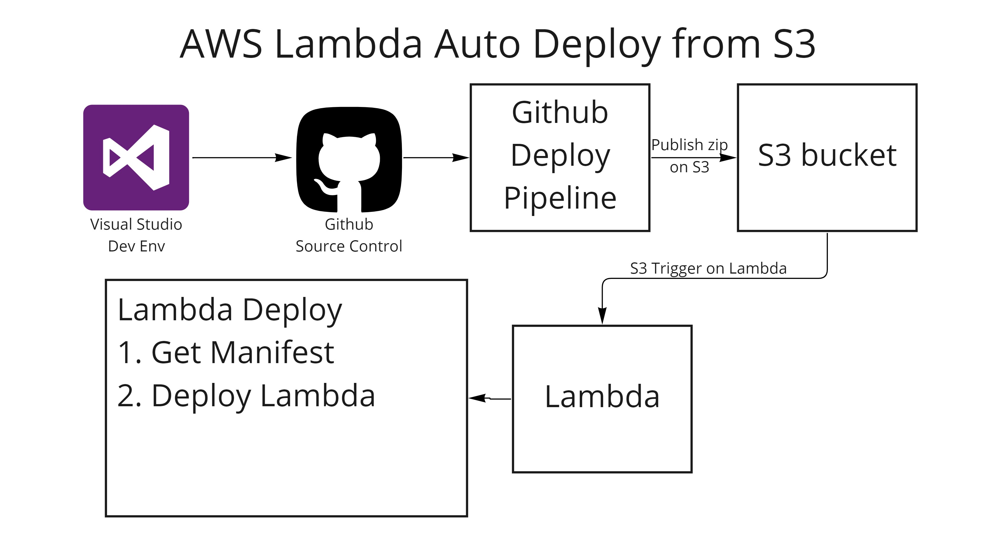

# AwsLambdaAutoDeploy 

This Tool aimes at providing auto deployment options for Lambda from multiple sources. 

## Pretext - Why ? 
The main I problem I thought around  is to deploy the lambda based on dotnet. The Lambda deployment for node and python can be pretty simpler, given there is a inline editor, for dotnet, "especially" while in development it could be pretty challanging to deploy each time while the code is changing. 
The CI pipeline do works, but i just wanted to have a cleaner deploy flow rather then using third party actions. In corporate environments this can even be more challanging given what actions from market place can be trusted. 1 Caveat still pending. Read below.

## What it Does
The solution is pretty simple. Initially  I thought on just deploying the basic Lambda S3 from the, I had a pretty good thoughts on how this can further be extended as defined in roadmap below. 

I shall try to add more features as needed *and as I get time.*
**Environment Support** is handled using Github Workflow parameters

**PRs / enhancements and ideas are WELCOME.** Please use the issues tab to communicate.

## Roadmap
Following is the roadmap for the current option
* Auto Deploy from S3. Completed. See below
* Auto Deploy from SNS (TODO)
* Support Lambdas for Listing versions (TODO)
* Management portal to deploy as needed (TODO)
* Remove dependency from external S3 Deployment action

# Auto Deploy Lambda from S3
[Project Ref](src/AwsLambdaAutoDeploy/AwsLambdaAutoDeploy.S3/AwsLambdaAutoDeploy.S3.csproj)
## Basic Design
The basic design is pretty simple and self explanatory. Refer to the image below:

## Steps
1. Run the workflow pipeline after commit. If you to run every time, use main as target, otherwise, use manual workflow.
   1. Workflow parameters can be used in input to control which environments to deploy. 
2. Make sure you have the correct S3 IAM and lambda policies defined. For reference the same can be found as described below:
   1. S3 Publish access permission for Github. [ref policy](src/SupportObjects/Policies/s3-push-from-github.json)
   2. Lambda Publish policy. [ref policy](src/SupportObjects/Policies/default-policy-lambda-publish-from-s3.json)
3. **Update and Upload** the Manifest file to root: Manifest file defines which lambda to deploy from which path. [sample manifest file](src/SupportObjects/Manifest/manifest.json)
4. you are all done. 

Most things are straightforward, in case you need any support, feel free to drop in the issues.